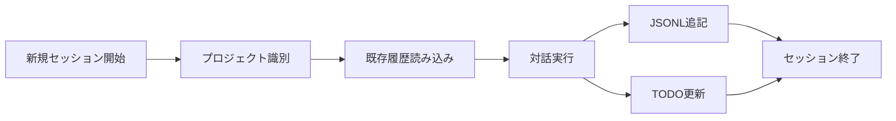

# Claude Code エコシステムの理解

## Claude Code とは

Claude Codeは、AIアシスタントClaudeをCLI環境で使用するための公式ツールです。開発者が自然言語でコーディングタスクを実行し、プロジェクト管理を行うことができます。

## エコシステムの構成要素

### 1. コア機能

**会話管理**
- セッションベースの対話
- プロジェクトごとの文脈保持
- 会話履歴の永続化

**ツール実行**
- ファイル操作（Read, Write, Edit）
- Bashコマンド実行
- Webサーチ、Webフェッチ
- TODOリスト管理

**プロジェクト認識**
- 作業ディレクトリごとの自動プロジェクト分離
- CLAUDE.mdによるプロジェクト固有の指示

### 2. データ永続化戦略

```
~/.claude/
├── projects/         # プロジェクト別データ
│   └── {encoded-path}/
│       └── {session-id}.jsonl
├── todos/           # TODOリスト
│   └── {session-id}-agent-{agent-id}.json
└── commands/        # カスタムコマンド
```

**なぜこの構造なのか**
- プロジェクトの独立性を保証
- セッションごとの履歴管理
- 効率的なデータ検索

### 3. セッションライフサイクル



## ccsummaryが解決する課題

### 1. 可視性の欠如

**問題**
- 複数プロジェクトでの作業が見えない
- 完了/未完了タスクの追跡が困難
- 生産性の測定が難しい

**解決**
- プロジェクト横断的な日報生成
- TODOステータスの可視化
- 活動統計の提供

### 2. 知識の分散

**問題**
- 会話履歴が分散して保存
- 過去の解決策を見つけにくい
- チーム間での知識共有が困難

**解決**
- 統合的なレポート生成
- 検索可能な形式での出力
- 共有しやすいMarkdown形式

## 他のツールとの連携可能性

### 1. CI/CD統合

```yaml
# .github/workflows/daily-summary.yml
name: Generate Claude Code Summary
on:
  schedule:
    - cron: '0 9 * * *'  # 毎日9時
jobs:
  summary:
    runs-on: ubuntu-latest
    steps:
      - uses: actions/checkout@v3
      - run: npx ccsummary@latest generate --date yesterday
      - run: |
          git add reports/
          git commit -m "Add daily Claude Code summary"
          git push
```

### 2. Slack/Discord通知

```typescript
// 将来的な拡張例
import { WebClient } from '@slack/web-api';

export async function postToSlack(report: string) {
  const client = new WebClient(process.env.SLACK_TOKEN);
  await client.chat.postMessage({
    channel: '#dev-reports',
    text: report,
    mrkdwn: true
  });
}
```

### 3. メトリクスダッシュボード

```typescript
// Prometheus形式でのメトリクス出力
export function generateMetrics(analysis: ClaudeAnalysisResult): string {
  return `
# HELP claude_code_sessions_total Total number of Claude Code sessions
# TYPE claude_code_sessions_total counter
claude_code_sessions_total ${analysis.totalSessions}

# HELP claude_code_messages_total Total number of messages
# TYPE claude_code_messages_total counter
claude_code_messages_total ${analysis.totalMessages}

# HELP claude_code_projects_active Number of active projects
# TYPE claude_code_projects_active gauge
claude_code_projects_active ${analysis.projects.length}
  `;
}
```

## セキュリティとプライバシー

### 1. ローカルファースト

- すべてのデータはローカルに保存
- 外部サービスへの依存なし
- ユーザーが完全にコントロール

### 2. 機密情報の考慮

```typescript
// 機密情報のフィルタリング例
function sanitizeContent(content: string): string {
  // 環境変数のマスキング
  return content.replace(/process\.env\.(\w+)/g, 'process.env.***');
}
```

### 3. アクセス制御

- ユーザーのホームディレクトリのみアクセス
- ファイルシステムの権限に従う
- 相対パストラバーサルの防止

## 将来の発展可能性

### 1. AIによる自動分析

```typescript
// 将来的な機能例
export async function generateInsights(analysis: ClaudeAnalysisResult) {
  // 生産性の傾向分析
  const productivityTrend = analyzeProductivityTrend(analysis);
  
  // よく使われるパターンの検出
  const commonPatterns = detectCommonPatterns(analysis);
  
  // 改善提案の生成
  const suggestions = generateSuggestions(productivityTrend, commonPatterns);
  
  return { productivityTrend, commonPatterns, suggestions };
}
```

### 2. チームコラボレーション

- チームメンバー間での日報共有
- プロジェクト進捗の可視化
- ベストプラクティスの抽出と共有

### 3. 学習支援

- コーディングパターンの分析
- スキル向上の追跡
- 個人化された学習提案

## まとめ

Claude Codeエコシステムは：

1. **開発者の生産性向上**を目的とした統合環境
2. **ローカルファースト**で安全な設計
3. **拡張可能**なアーキテクチャ

ccsummaryは、このエコシステムの価値を最大化するための重要なツールとして位置づけられます。日報生成を通じて、開発者は自身の活動を振り返り、チームは進捗を共有し、組織は生産性を向上させることができます。

今後も、Claude Codeエコシステムは進化を続け、より多くの開発者のワークフローに統合されていくことが期待されます。